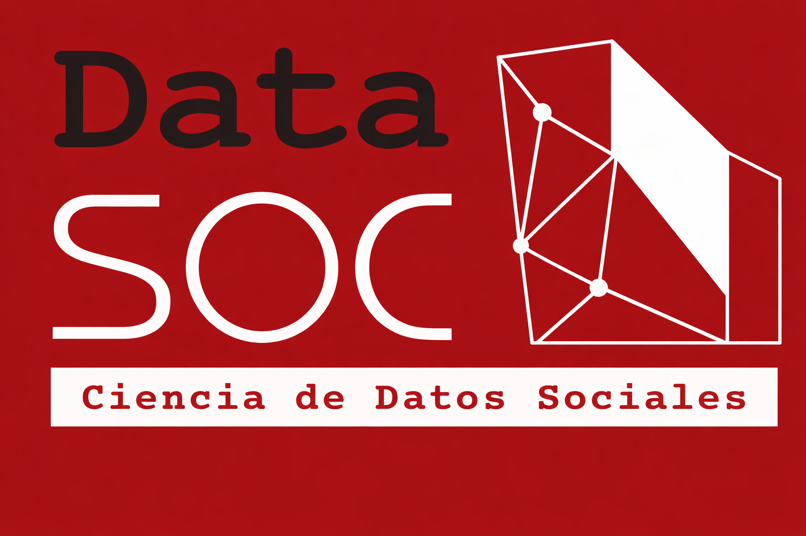

---
format:
  revealjs:
    theme: ../libs/datasoc.scss
    transition: slide
    transition-speed: slow
    slide-number: true
    show-slide-number: print
    embed-resources: false
    width: 1280
    height: 720
editor: source
bibliography: ../input/bib/refs.bib
lang: es
execute:
  echo: false
  message: false
  warning: false
---

```{r}
#| label: librerias
library(tidyverse)
library(here)
library(kableExtra)
library(forcats)
library(chilemapas)
library(patchwork)
library(plotly)
library(sf)
```

```{r}
#| label: data

# Cargar datos
load(here("input", "data", "proc", "base_fondecyt_completa.RData"))
load(here("input", "data", "proc", "base_fondecyt_sociales_merge_monto.RData"))
load(here("input", "data", "proc", "adjudicacion_milenio_limpia_sociales.RData"))

# Tema base
tema_anid <- theme_minimal(base_size = 12) +
  theme(
    plot.title    = element_text(face = "bold", size = 13),
    plot.subtitle = element_text(color = "grey40", size = 11),
    axis.title    = element_text(size = 11),
    legend.position = "bottom",
    panel.grid.minor = element_blank()
  )

# Vectores de clasificación de instituciones
cruch <- c(
  "UNIVERSIDAD DE CHILE", "PONTIFICIA UNIVERSIDAD CATOLICA DE CHILE",
  "UNIVERSIDAD DE SANTIAGO DE CHILE", "UNIVERSIDAD DE CONCEPCION",
  "UNIVERSIDAD AUSTRAL DE CHILE", "UNIVERSIDAD CATOLICA DEL NORTE",
  "UNIVERSIDAD DE VALPARAISO", "PONTIFICIA UNIVERSIDAD CATOLICA DE VALPARAISO",
  "PONTIFICA UNIVERSIDAD CATOLICA DE VALPARAISO",
  "UNIVERSIDAD TECNICA FEDERICO SANTA MARIA", "UNIVERSIDAD DE LA FRONTERA",
  "UNIVERSIDAD DE TALCA", "UNIVERSIDAD DEL BIO BIO",
  "UNIVERSIDAD DE LA SERENA", "UNIVERSIDAD DE TARAPACA",
  "UNIVERSIDAD DE ANTOFAGASTA", "UNIVERSIDAD DE ATACAMA",
  "UNIVERSIDAD DE LOS LAGOS", "UNIVERSIDAD DE MAGALLANES",
  "UNIVERSIDAD CATOLICA DEL MAULE", "UNIVERSIDAD CATOLICA DE TEMUCO",
  "UNIVERSIDAD CATOLICA DE LA SANTISIMA CONCEPCION",
  "UNIVERSIDAD ARTURO PRAT", "UNIVERSIDAD METROPOLITANA DE CIENCIAS DE LA EDUCACION",
  "UNIVERSIDAD TECNOLOGICA METROPOLITANA",
  "UNIVERSIDAD DE PLAYA ANCHA DE CIENCIAS DE LA EDUCACION",
  "UNIVERSIDAD DE O'HIGGINS", "UNIVERSIDAD DE AYSEN",
  "UNIVERSIDAD ALBERTO HURTADO", "UNIVERSIDAD DIEGO PORTALES",
  "UNIVERSIDAD DE LOS ANDES"
)

no_cruch <- c(
  "UNIVERSIDAD ADOLFO IBANEZ", "UNIVERSIDAD NACIONAL ANDRES BELLO",
  "UNIVERSIDAD DEL DESARROLLO", "UNIVERSIDAD AUTONOMA DE CHILE",
  "UNIVERSIDAD CENTRAL DE CHILE", "UNIVERSIDAD CATOLICA CARDENAL SILVA HENRIQUEZ",
  "UNIVERSIDAD ACADEMIA DE HUMANISMO CRISTIANO", "UNIVERSIDAD MAYOR",
  "UNIVERSIDAD SAN SEBASTIAN", "UNIVERSIDAD SANTO TOMAS",
  "UNIVERSIDAD BERNARDO O'HIGGINS", "UNIVERSIDAD FINIS TERRAE",
  "UNIVERSIDAD DE LAS AMERICAS", "UNIVERSIDAD VINA DEL MAR",
  "UNIVERSIDAD GABRIELA MISTRAL"
)

publicas <- c(
  "UNIVERSIDAD DE CHILE", "UNIVERSIDAD DE SANTIAGO DE CHILE",
  "UNIVERSIDAD DE VALPARAISO", "UNIVERSIDAD DE LA FRONTERA",
  "UNIVERSIDAD DE TALCA", "UNIVERSIDAD DEL BIO BIO",
  "UNIVERSIDAD DE LA SERENA", "UNIVERSIDAD DE TARAPACA",
  "UNIVERSIDAD DE ANTOFAGASTA", "UNIVERSIDAD DE ATACAMA",
  "UNIVERSIDAD DE LOS LAGOS", "UNIVERSIDAD DE MAGALLANES",
  "UNIVERSIDAD ARTURO PRAT", "UNIVERSIDAD METROPOLITANA DE CIENCIAS DE LA EDUCACION",
  "UNIVERSIDAD TECNOLOGICA METROPOLITANA",
  "UNIVERSIDAD DE PLAYA ANCHA DE CIENCIAS DE LA EDUCACION",
  "UNIVERSIDAD DE O'HIGGINS", "UNIVERSIDAD DE AYSEN"
)
```

# {background-color="#a81014"}

<span style="font-size:54px; color:white; font-weight:bold;">Estudio de Fondos ANID en Ciencias Sociales</span>

<span style="font-size:28px; color:white;">Patrones de financiamiento FONDECYT y Milenio (2016-2025)</span>

<hr>

::: {.columns .v-center-container}
::: {.column width="40%"}

{width="70%"}

:::

::: {.column width="60%"}

**René Canales** <br> **Facultad de Ciencias Sociales** <br> **Universidad de Chile**

[Informe completo del estudio](https://github.com/renejcanales/fondos-css)

:::
:::

# Introducción y contexto {background-color="#212525"}

## Antecedentes

:::{.incremental .highlight-last style="font-size: 35px;"}

- En Chile, el financiamiento científico se distribuye principalmente a través de **FONDECYT** (desde 1981) y la **Iniciativa Científica Milenio** (desde 1998), administrados por ANID [@ramos-zincke_wellbehaved_2021].

- Las Ciencias Sociales y Humanidades enfrentan tensiones particulares en sistemas de financiamiento basados en métricas de impacto bibliométrico [@brunner_investigacion_2021; @nederhof_bibliometric_2006].

- En la última década, el campo en Chile se ha **densificado aceleradamente**: la oferta de doctorados creció un 61% entre 2017 y 2023 [@ministerio_radiografía_2023].

:::

## El problema

:::{.incremental .highlight-last style="font-size: 35px;"}

- Sabemos que el campo tiene **más investigadores, más programas, más producción indexada**.

- Sabemos que **las universidades tradicionales concentran el 85% de los proyectos FONDECYT** [@ramos-zincke_wellbehaved_2021].

- Lo que **no sabemos**:
  - ¿Está el sistema absorbiendo proporcionalmente la presión?
  - ¿Qué factores explican los patrones de adjudicación?
  - ¿Cómo se distribuyen los recursos al interior de la disciplina?

:::

## Objetivos

::: {.box-inv-4 .sp-after .fragment style="font-size: 90%;"}

**Caracterizar** las postulaciones y adjudicaciones FONDECYT (Iniciación y Regular) y Núcleos e Institutos Milenio en Ciencias Sociales entre 2016 y 2025.

:::

::: {.box-inv-4 .sp-after .fragment style="font-size: 90%;"}

**Examinar** las asimetrías estructurales del sistema a partir de cuatro dimensiones: género, grupo de estudio, institución patrocinante y macrozona.

:::

## Metodología {.scrollable}

::: {style="font-size: 24px;"}

**Bases de datos** (repositorio público ANID + reconstrucción manual desde PDFs oficiales):

- `base_fondecyt_completa`: 2016-2025, todas las áreas OCDE.
- `base_fondecyt_sociales_merge_monto`: 8.603 postulaciones de Ciencias Sociales.
- `adjudicacion_milenio_limpia_sociales`: 26 adjudicaciones en CS (2016-2022).

**Aporte metodológico**: reconstrucción de las series de montos solicitados y adjudicados por grupo-año-instrumento desde los PDFs oficiales de cada concurso.

$$\text{Tasa de adjudicación} = \frac{N_{\text{adjudicado}}}{N_{\text{adjudicado}} + N_{\text{no adjudicado}}}$$

$$\text{Monto promedio} = \frac{\text{Recursos Totales (miles CLP)} \times 1000}{N^{\circ} \text{ proyectos}}$$

:::

# FONDECYT Iniciación {background-color="#212525"}

## Postulaciones por área OCDE

```{r}
#| fig-width: 12
#| fig-height: 6

base_final_completa %>%
  filter(INSTRUMENTO == "INICIACION",
         DISCIPLINA_OECD != "MULTIDISCIPLINA") %>%
  mutate(
    ESTADO = if_else(ESTADO_RESOLUCION_CONCURSO == "ADJUDICADO",
                     "Adjudicado", "No adjudicado")
  ) %>%
  group_by(AGNO_FALLO, DISCIPLINA_OECD, ESTADO) %>%
  summarise(total = n(), .groups = "drop") %>%
  ggplot(aes(x = factor(AGNO_FALLO), y = total, fill = ESTADO)) +
  geom_col(position = "stack") +
  facet_wrap(~ DISCIPLINA_OECD, scales = "fixed") +
  scale_fill_manual(values = c("Adjudicado"    = "#770606",
                                "No adjudicado" = "#d87676")) +
  labs(x = NULL, y = "N° postulaciones", fill = NULL,
       caption = "Fuente: ANID 2016-2025, elaboración propia.\n*2021 sin concurso.") +
  tema_anid +
  theme(axis.text.x = element_text(angle = 45, hjust = 1, size = 8),
        plot.caption = element_text(hjust = 0, size = 8, color = "gray40",
                                     face = "italic", margin = margin(t = 10)))
```

## Hallazgos: perspectiva comparada

:::{.incremental .highlight-last style="font-size: 35px;"}

- Las Ciencias Sociales **superan 600 postulaciones anuales en 2025**.

- Volumen que **duplica a Ingeniería** y **cuadruplica a Ciencias Médicas**.

- El número de proyectos no seleccionados (en rojo claro) es proporcionalmente el más elevado.

- Esto evidencia una **presión competitiva extrema** sobre el instrumento.

:::

## Tasa de adjudicación por área

```{r}
#| fig-width: 11
#| fig-height: 6

df_adj <- base_final_completa %>%
  filter(INSTRUMENTO == "INICIACION",
         DISCIPLINA_OECD != "MULTIDISCIPLINA") %>%
  group_by(AGNO_FALLO, DISCIPLINA_OECD) %>%
  summarise(postulados = n(),
            adjudicado = sum(ESTADO_RESOLUCION_CONCURSO == "ADJUDICADO"),
            .groups = "drop") %>%
  mutate(tasa = adjudicado / postulados * 100)

plot_ly() %>%
  add_trace(data = df_adj, x = ~AGNO_FALLO, y = ~tasa,
            color = ~DISCIPLINA_OECD, type = "scatter",
            mode = "lines+markers",
            text = ~paste0(DISCIPLINA_OECD, "<br>", AGNO_FALLO, ": ",
                          round(tasa, 1), "%"),
            hoverinfo = "text",
            line = list(width = 2), marker = list(size = 7)) %>%
  layout(
    xaxis = list(title = "", tickvals = unique(df_adj$AGNO_FALLO), tickformat = "d"),
    yaxis = list(title = "Tasa de adjudicación (%)", range = c(0, 100),
                 ticksuffix = "%"),
    legend = list(title = list(text = "Disciplina OCDE"))
  )
```

## Diferencias por género

```{r}
#| fig-width: 11
#| fig-height: 5.5

base_final_sociales %>%
  filter(INSTRUMENTO == "INICIACION", SEXO != "SIN INFORMACION") %>%
  group_by(AGNO_FALLO, SEXO) %>%
  summarise(total = n(), .groups = "drop") %>%
  group_by(AGNO_FALLO) %>%
  mutate(pct = round(total / sum(total) * 100, 1)) %>%
  ungroup() %>%
  ggplot(aes(x = factor(AGNO_FALLO), y = total, fill = SEXO)) +
  geom_col(position = "stack") +
  geom_text(aes(label = paste0(total, "\n(", pct, "%)")),
            position = position_stack(vjust = 0.5),
            size = 3, fontface = "bold", color = "white") +
  scale_fill_manual(values = c("HOMBRE" = "#1a5276", "MUJER" = "#c0392b")) +
  labs(x = NULL, y = "N° postulaciones", fill = NULL,
       caption = "Fuente: ANID 2016-2025, elaboración propia.\n*2021 sin concurso.") +
  tema_anid +
  theme(legend.position = "top",
        axis.text.x = element_text(angle = 45, hjust = 1),
        plot.caption = element_text(hjust = 0, size = 8, color = "gray40",
                                     face = "italic", margin = margin(t = 10)))
```

## Hallazgos: género

:::{.incremental .highlight-last style="font-size: 35px;"}

- Crecimiento sostenido del total de postulaciones (335 → 645 entre 2016 y 2025).

- En el periodo inicial, los hombres representaban el 53-58%.

- Desde 2022 las proporciones **se acercan a la paridad**: 49.4% mujeres / 50.6% hombres.

- A diferencia de Regular, en Iniciación se observa **una tendencia clara hacia la equidad**.

:::

## Adjudicaciones por grupo de estudio

```{r}
#| fig-width: 11
#| fig-height: 5.5

df_soc <- base_final_sociales %>%
  filter(INSTRUMENTO == "INICIACION",
         ESTADO_RESOLUCION_CONCURSO == "ADJUDICADO",
         !is.na(GRUPO_ESTUDIO),
         GRUPO_ESTUDIO %in% c(
           "Antropología y Arqueología",
           "Sociología, Trabajo Social y Cs. de la Comunicación",
           "Psicología", "Ciencias Jurídicas y Políticas",
           "Educación", "Geografía y Urbanismo"
         )) %>%
  group_by(AGNO_FALLO, GRUPO_ESTUDIO) %>%
  summarise(total = n(), .groups = "drop")

colores <- c(
  "Educación" = "#44708b",
  "Ciencias Jurídicas y Políticas" = "#c77972",
  "Sociología, Trabajo Social y Cs. de la Comunicación" = "#499669",
  "Psicología" = "#8f6d9c",
  "Antropología y Arqueología" = "#c9b97b",
  "Geografía y Urbanismo" = "#d9a679"
)

p <- plot_ly()
for (grp in unique(df_soc$GRUPO_ESTUDIO)) {
  df_grp <- df_soc %>% filter(GRUPO_ESTUDIO == grp)
  p <- p %>%
    add_trace(data = df_grp, x = ~factor(AGNO_FALLO), y = ~total,
              type = "bar", name = grp,
              marker = list(color = colores[[grp]]),
              hovertemplate = paste0("<b>", grp, "</b><br>",
                                     "Año: %{x}<br>",
                                     "Adjudicados: %{y}",
                                     "<extra></extra>"))
}
p %>% layout(barmode = "stack", xaxis = list(title = ""),
             yaxis = list(title = "N° adjudicaciones"),
             legend = list(title = list(text = "")))
```

## Hallazgos: grupos de estudio

:::{.incremental .highlight-last style="font-size: 35px;"}

- **Educación** lidera con un crecimiento sostenido durante todo el periodo.

- En segundo lugar: **Ciencias Jurídicas y Políticas** y **Sociología, Trabajo Social y Cs. de la Comunicación**.

- **Geografía y Urbanismo** y **Antropología y Arqueología** mantienen volúmenes más bajos pero estables.

- El crecimiento del área es **transversal**: todos los grupos aumentan adjudicaciones hacia 2025.

:::

## Composición por género dentro de grupos

```{r}
#| fig-width: 12
#| fig-height: 5.8

base_final_sociales %>%
  filter(INSTRUMENTO == "INICIACION",
         ESTADO_RESOLUCION_CONCURSO == "ADJUDICADO",
         SEXO != "SIN INFORMACION",
         !is.na(GRUPO_ESTUDIO)) %>%
  count(AGNO_FALLO, GRUPO_ESTUDIO, SEXO, name = "adjudicados") %>%
  complete(AGNO_FALLO, GRUPO_ESTUDIO, SEXO, fill = list(adjudicados = 0)) %>%
  group_by(AGNO_FALLO, GRUPO_ESTUDIO) %>%
  mutate(total_grupo = sum(adjudicados),
         pct = if_else(total_grupo > 0,
                       round(adjudicados / total_grupo * 100, 1),
                       NA_real_)) %>%
  ungroup() %>%
  ggplot(aes(x = factor(AGNO_FALLO), y = GRUPO_ESTUDIO, fill = pct)) +
  geom_tile(color = "white", linewidth = 0.5) +
  geom_text(aes(label = if_else(is.na(pct), "—", paste0(pct, "%"))),
            size = 2.3, fontface = "bold", color = "white") +
  facet_wrap(~ SEXO, ncol = 2) +
  scale_fill_gradient(low = "#ebb0b0", high = "#420303",
                      na.value = "gray90", limits = c(0, 100)) +
  scale_y_discrete(labels = function(x) str_wrap(x, width = 30)) +
  labs(x = NULL, y = NULL, fill = "% dentro de\nadjudicados",
       caption = "Fuente: ANID 2016-2025, elaboración propia.") +
  tema_anid +
  theme(axis.text.x = element_text(angle = 45, hjust = 1, size = 7),
        axis.text.y = element_text(size = 7),
        strip.text = element_text(size = 10, face = "bold"),
        plot.caption = element_text(hjust = 0, size = 8, color = "gray40",
                                     face = "italic", margin = margin(t = 10)))
```

## Monto promedio adjudicado por grupo

```{r}
#| fig-width: 11
#| fig-height: 5.5

df_plot <- base_final_sociales |>
  filter(INSTRUMENTO == "INICIACION",
         !is.na(GRUPO_ESTUDIO),
         !is.na(MONTO_PROM_GRUPO_ANIO),
         !is.na(AGNO_FALLO)) |>
  group_by(GRUPO_ESTUDIO, AGNO_FALLO) |>
  summarise(monto_prom = mean(MONTO_PROM_GRUPO_ANIO, na.rm = TRUE),
            .groups = "drop")

grupos <- unique(df_plot$GRUPO_ESTUDIO)
fig <- plot_ly()
for (g in grupos) {
  d <- df_plot |> filter(GRUPO_ESTUDIO == g)
  fig <- fig |>
    add_trace(data = d, x = ~AGNO_FALLO, y = ~monto_prom,
              type = "scatter", mode = "lines+markers", name = g,
              hovertemplate = paste0("<b>", g, "</b><br>",
                                     "Año: %{x}<br>",
                                     "Monto prom.: $%{y:,.0f}",
                                     "<extra></extra>"))
}
fig |> layout(xaxis = list(title = "Año de fallo", tickmode = "linear", dtick = 1),
              yaxis = list(title = "Monto promedio adjudicado (CLP)",
                           tickformat = "$,.0f"),
              legend = list(title = list(text = "Grupo de estudio")))
```

## Instituciones líderes (Top 15)

```{r}
#| fig-width: 11
#| fig-height: 5.5

base_final_sociales %>%
  filter(ESTADO_RESOLUCION_CONCURSO == "ADJUDICADO",
         INSTRUMENTO == "INICIACION") %>%
  count(INSTITUCION_PRINCIPAL, sort = TRUE) %>%
  slice_max(n, n = 15) %>%
  mutate(INSTITUCION_PRINCIPAL = fct_reorder(INSTITUCION_PRINCIPAL, n)) %>%
  ggplot(aes(x = n, y = INSTITUCION_PRINCIPAL)) +
  geom_col(fill = "#6e0c0c") +
  geom_text(aes(label = n), hjust = -0.3, size = 3.5, fontface = "bold") +
  scale_x_continuous(expand = expansion(mult = c(0, 0.1))) +
  labs(x = "Número de adjudicaciones", y = NULL,
       caption = "Fuente: ANID 2016-2025, elaboración propia") +
  tema_anid +
  theme(axis.text.y = element_text(size = 9))
```

## CRUCH vs No CRUCH

```{r}
#| fig-width: 11
#| fig-height: 5.5

base_final_sociales %>%
  filter(INSTRUMENTO == "INICIACION",
         ESTADO_RESOLUCION_CONCURSO == "ADJUDICADO") %>%
  mutate(TIPO_INSTITUCION = case_when(
    INSTITUCION_PRINCIPAL %in% cruch    ~ "CRUCH",
    INSTITUCION_PRINCIPAL %in% no_cruch ~ "No CRUCH",
    TRUE                                ~ NA_character_
  )) %>%
  filter(!is.na(TIPO_INSTITUCION)) %>%
  count(AGNO_FALLO, TIPO_INSTITUCION, name = "adjudicados") %>%
  ggplot(aes(x = factor(AGNO_FALLO), y = adjudicados, fill = TIPO_INSTITUCION)) +
  geom_col(position = position_dodge(width = 0.85), width = 0.75) +
  geom_text(aes(label = adjudicados),
            position = position_dodge(width = 0.85),
            vjust = -0.4, size = 3, fontface = "bold") +
  scale_fill_manual(values = c("CRUCH" = "#6e0c0c", "No CRUCH" = "#c77972")) +
  labs(x = NULL, y = "N° adjudicaciones", fill = NULL,
       caption = "Fuente: ANID 2016-2025, elaboración propia.") +
  tema_anid +
  theme(axis.text.x = element_text(angle = 45, hjust = 1),
        plot.caption = element_text(hjust = 0, size = 8, color = "gray40",
                                     face = "italic", margin = margin(t = 10)))
```

## Pública vs Privada

```{r}
#| fig-width: 11
#| fig-height: 5.5

base_final_sociales %>%
  filter(INSTRUMENTO == "INICIACION",
         ESTADO_RESOLUCION_CONCURSO == "ADJUDICADO",
         !is.na(INSTITUCION_PRINCIPAL),
         (INSTITUCION_PRINCIPAL %in% cruch | INSTITUCION_PRINCIPAL %in% no_cruch)) %>%
  mutate(NATURALEZA = if_else(INSTITUCION_PRINCIPAL %in% publicas,
                              "Pública", "Privada")) %>%
  count(AGNO_FALLO, NATURALEZA, name = "adjudicados") %>%
  ggplot(aes(x = factor(AGNO_FALLO), y = adjudicados, fill = NATURALEZA)) +
  geom_col(position = position_dodge(width = 0.85), width = 0.75) +
  geom_text(aes(label = adjudicados),
            position = position_dodge(width = 0.85),
            vjust = -0.4, size = 3, fontface = "bold") +
  scale_fill_manual(values = c("Pública" = "#1a5276", "Privada" = "#c77972")) +
  labs(x = NULL, y = "N° adjudicaciones", fill = NULL,
       caption = "Fuente: ANID 2016-2025, elaboración propia.") +
  tema_anid +
  theme(axis.text.x = element_text(angle = 45, hjust = 1),
        plot.caption = element_text(hjust = 0, size = 8, color = "gray40",
                                     face = "italic", margin = margin(t = 10)))
```

## Hallazgos: instituciones

:::{.incremental .highlight-last style="font-size: 26px;"}

- **CRUCH concentra el 77%** de las adjudicaciones en Iniciación (2025).

- Las **privadas** captan el 72% (cuando se desagrega por naturaleza jurídica).

- Esta diferencia revela una **doble estratificación**:
  - **Vertical** (CRUCH vs no CRUCH): asociada a trayectoria.
  - **Horizontal** (pública vs privada): asociada a naturaleza jurídica.

- Las dos lecturas son complementarias, no contradictorias.

:::

## Distribución territorial

```{r}
#| fig-width: 11
#| fig-height: 5.5

macrozona_regiones <- tibble(
  MACROZONA_MINCIENCIA = c(
    "NORTE", "NORTE", "NORTE",
    "CENTRO", "CENTRO", "CENTRO",
    "RM",
    "CENTRO SUR", "CENTRO SUR",
    "SUR", "SUR", "SUR",
    "AUSTRAL", "AUSTRAL", "AUSTRAL", "AUSTRAL"
  ),
  codigo_region = c(
    "15", "01", "02",
    "03", "04", "05",
    "13",
    "06", "07",
    "16", "08", "09",
    "14", "10", "11", "12"
  )
)

datos_mapa <- base_final_sociales %>%
  filter(INSTRUMENTO == "INICIACION",
         MACROZONA_MINCIENCIA != "SIN INFORMACION") %>%
  group_by(MACROZONA_MINCIENCIA) %>%
  summarise(total = n(),
            adjudicado = sum(ESTADO_RESOLUCION_CONCURSO == "ADJUDICADO"),
            tasa = adjudicado / total * 100,
            .groups = "drop") %>%
  left_join(macrozona_regiones, by = "MACROZONA_MINCIENCIA")

geo_base <- chilemapas::mapa_comunas %>%
  group_by(codigo_region) %>%
  summarise(geometry = st_union(geometry), .groups = "drop") %>%
  st_as_sf() %>%
  left_join(datos_mapa, by = "codigo_region")

tema_leyenda <- theme(
  legend.position  = "right",
  legend.direction = "vertical",
  legend.key.height = unit(1.5, "cm"),
  legend.key.width  = unit(0.4, "cm"),
  legend.text       = element_text(size = 8),
  legend.title      = element_text(size = 9, face = "bold")
)

mapa1 <- ggplot(geo_base) +
  geom_sf(aes(fill = total), color = "white", linewidth = 0.3) +
  scale_fill_gradient(low = "#f0a3a3", high = "#5e0e0e", na.value = "gray90") +
  labs(title = "Postulaciones", fill = "N") +
  tema_anid + tema_leyenda +
  theme(axis.text = element_blank(), axis.ticks = element_blank(),
        panel.grid = element_blank())

mapa2 <- ggplot(geo_base) +
  geom_sf(aes(fill = tasa), color = "white", linewidth = 0.3) +
  scale_fill_gradient(low = "#f0a3a3", high = "#5e0e0e", na.value = "gray90",
                      labels = scales::percent_format(scale = 1)) +
  labs(title = "Tasa de adjudicación", fill = "%") +
  tema_anid + tema_leyenda +
  theme(axis.text = element_blank(), axis.ticks = element_blank(),
        panel.grid = element_blank())

mapa1 + mapa2
```

## Hallazgos: territorial

:::{.incremental .highlight-last style="font-size: 35px;"}

- La macrozona **Metropolitana concentra la mayoría** de postulaciones y adjudicaciones.

- Crecimiento de RM: **48 adjudicaciones en 2016 → 97 en 2025**.

- Regiones se mantienen estancadas en rangos bajos (Norte y Austral cercanos a cero).

- **La brecha capital-regiones no se reduce, se amplía**.

:::

# FONDECYT Regular {background-color="#212525"}

## Postulaciones por área OCDE

```{r}
#| fig-width: 12
#| fig-height: 6

base_final_completa %>%
  filter(INSTRUMENTO == "REGULAR",
         DISCIPLINA_OECD != "MULTIDISCIPLINA") %>%
  mutate(ESTADO = if_else(ESTADO_RESOLUCION_CONCURSO == "ADJUDICADO",
                          "Adjudicado", "No adjudicado")) %>%
  group_by(AGNO_FALLO, DISCIPLINA_OECD, ESTADO) %>%
  summarise(total = n(), .groups = "drop") %>%
  ggplot(aes(x = factor(AGNO_FALLO), y = total, fill = ESTADO)) +
  geom_col(position = "stack") +
  facet_wrap(~ DISCIPLINA_OECD, scales = "fixed") +
  scale_fill_manual(values = c("Adjudicado"    = "#770606",
                                "No adjudicado" = "#d87676")) +
  labs(x = NULL, y = "N° postulaciones", fill = NULL,
       caption = "Fuente: ANID 2016-2025, elaboración propia.") +
  tema_anid +
  theme(axis.text.x = element_text(angle = 45, hjust = 1, size = 8),
        plot.caption = element_text(hjust = 0, size = 8, color = "gray40",
                                     face = "italic", margin = margin(t = 10)))
```

## Hallazgos: perspectiva comparada

:::{.incremental .highlight-last style="font-size: 35px;"}

- Las Ciencias Sociales se ubican junto a **Ciencias Naturales** en el liderazgo del instrumento.

- Supera consistentemente las **400 postulaciones anuales**, con máximo histórico en 2025.

- A diferencia de Iniciación, **no presentó contracción en 2023** — trayectoria estable.

- Tasa de adjudicación estable en torno al **30-35%**, sin volatilidad.

:::

## Diferencias por género

```{r}
#| fig-width: 11
#| fig-height: 5.5

base_final_sociales %>%
  filter(INSTRUMENTO == "REGULAR", SEXO != "SIN INFORMACION") %>%
  group_by(AGNO_FALLO, SEXO) %>%
  summarise(total = n(), .groups = "drop") %>%
  group_by(AGNO_FALLO) %>%
  mutate(pct = round(total / sum(total) * 100, 1)) %>%
  ungroup() %>%
  ggplot(aes(x = factor(AGNO_FALLO), y = total, fill = SEXO)) +
  geom_col(position = "stack") +
  geom_text(aes(label = paste0(total, "\n(", pct, "%)")),
            position = position_stack(vjust = 0.5),
            size = 3, fontface = "bold", color = "white") +
  scale_fill_manual(values = c("HOMBRE" = "#1a5276", "MUJER" = "#c0392b")) +
  labs(x = NULL, y = "N° postulaciones", fill = NULL,
       caption = "Fuente: ANID 2016-2025, elaboración propia.\n*2021 sin concurso.") +
  tema_anid +
  theme(legend.position = "top",
        axis.text.x = element_text(angle = 45, hjust = 1),
        plot.caption = element_text(hjust = 0, size = 8, color = "gray40",
                                     face = "italic", margin = margin(t = 10)))
```

## Brecha de género: hallazgo clave

::: {.box-inv-4 .sp-after .fragment style="font-size: 90%;"}

En Regular, las mujeres se mantienen **estancadas en ~38% de las postulaciones** durante toda la década.

:::

::: {.box-inv-4 .sp-after .fragment style="font-size: 90%;"}

Sin embargo, sus **tasas de adjudicación son comparables o superiores** a las masculinas en varios años (2017, 2023-2024).

:::

::: {.box-inv-4 .sp-after .fragment style="font-size: 90%;"}

La brecha opera en la **etapa de postulación**, no en la evaluación. Hipótesis del *"leaky pipeline"*.

:::

## Monto promedio adjudicado por grupo

```{r}
#| fig-width: 11
#| fig-height: 5.5

df_plot <- base_final_sociales |>
  filter(INSTRUMENTO == "REGULAR",
         ESTADO_RESOLUCION_CONCURSO == "ADJUDICADO",
         !is.na(GRUPO_ESTUDIO),
         !is.na(MONTO_PROM_GRUPO_ANIO),
         !is.na(AGNO_FALLO)) |>
  group_by(GRUPO_ESTUDIO, AGNO_FALLO) |>
  summarise(monto_prom = mean(MONTO_PROM_GRUPO_ANIO, na.rm = TRUE),
            .groups = "drop")

grupos <- unique(df_plot$GRUPO_ESTUDIO)
fig <- plot_ly()
for (g in grupos) {
  d <- df_plot |> filter(GRUPO_ESTUDIO == g)
  fig <- fig |>
    add_trace(data = d, x = ~AGNO_FALLO, y = ~monto_prom,
              type = "scatter", mode = "lines+markers", name = g,
              hovertemplate = paste0("<b>", g, "</b><br>",
                                     "Año: %{x}<br>",
                                     "Monto prom.: $%{y:,.0f}",
                                     "<extra></extra>"))
}
fig |> layout(xaxis = list(title = "Año de fallo", tickmode = "linear", dtick = 1),
              yaxis = list(title = "Monto promedio adjudicado (CLP)",
                           tickformat = "$,.0f"),
              legend = list(title = list(text = "Grupo de estudio")))
```

## Instituciones líderes (Top 15)

```{r}
#| fig-width: 11
#| fig-height: 5.5

base_final_sociales %>%
  filter(ESTADO_RESOLUCION_CONCURSO == "ADJUDICADO",
         INSTRUMENTO == "REGULAR") %>%
  count(INSTITUCION_PRINCIPAL, sort = TRUE) %>%
  slice_max(n, n = 15) %>%
  mutate(INSTITUCION_PRINCIPAL = fct_reorder(INSTITUCION_PRINCIPAL, n)) %>%
  ggplot(aes(x = n, y = INSTITUCION_PRINCIPAL)) +
  geom_col(fill = "#6e0c0c") +
  geom_text(aes(label = n), hjust = -0.3, size = 3.5, fontface = "bold") +
  scale_x_continuous(expand = expansion(mult = c(0, 0.1))) +
  labs(x = "Número de adjudicaciones", y = NULL,
       caption = "Fuente: ANID 2016-2025, elaboración propia") +
  tema_anid +
  theme(axis.text.y = element_text(size = 9))
```

## CRUCH vs No CRUCH (Regular)

```{r}
#| fig-width: 11
#| fig-height: 5.5

base_final_sociales %>%
  filter(INSTRUMENTO == "REGULAR",
         ESTADO_RESOLUCION_CONCURSO == "ADJUDICADO") %>%
  mutate(TIPO_INSTITUCION = case_when(
    INSTITUCION_PRINCIPAL %in% cruch    ~ "CRUCH",
    INSTITUCION_PRINCIPAL %in% no_cruch ~ "No CRUCH",
    TRUE                                ~ NA_character_
  )) %>%
  filter(!is.na(TIPO_INSTITUCION)) %>%
  count(AGNO_FALLO, TIPO_INSTITUCION, name = "adjudicados") %>%
  ggplot(aes(x = factor(AGNO_FALLO), y = adjudicados, fill = TIPO_INSTITUCION)) +
  geom_col(position = position_dodge(width = 0.85), width = 0.75) +
  geom_text(aes(label = adjudicados),
            position = position_dodge(width = 0.85),
            vjust = -0.4, size = 3, fontface = "bold") +
  scale_fill_manual(values = c("CRUCH" = "#6e0c0c", "No CRUCH" = "#c77972")) +
  labs(x = NULL, y = "N° adjudicaciones", fill = NULL,
       caption = "Fuente: ANID 2016-2025, elaboración propia.") +
  tema_anid +
  theme(axis.text.x = element_text(angle = 45, hjust = 1),
        plot.caption = element_text(hjust = 0, size = 8, color = "gray40",
                                     face = "italic", margin = margin(t = 10)))
```

## Asimetría profundizada en Regular

::: {.box-inv-4 .sp-after .fragment style="font-size: 88%;"}

En Regular, las **CRUCH concentran el 81%** de las adjudicaciones — brecha más pronunciada que en Iniciación.

:::

::: {.box-inv-4 .sp-after .fragment style="font-size: 88%;"}

Regular **privilegia trayectorias consolidadas** como PI, lo que refuerza la ventaja acumulativa del sistema tradicional.

:::

::: {.box-inv-4 .sp-after .fragment style="font-size: 88%;"}

Las nuevas universidades **encuentran un techo más rígido** en el tramo senior del financiamiento concursable.

:::

## Distribución territorial (Regular)

```{r}
#| fig-width: 11
#| fig-height: 5.5

datos_mapa_reg <- base_final_sociales %>%
  filter(INSTRUMENTO == "REGULAR",
         MACROZONA_MINCIENCIA != "SIN INFORMACION") %>%
  group_by(MACROZONA_MINCIENCIA) %>%
  summarise(total = n(),
            adjudicado = sum(ESTADO_RESOLUCION_CONCURSO == "ADJUDICADO"),
            tasa = adjudicado / total * 100,
            .groups = "drop") %>%
  left_join(macrozona_regiones, by = "MACROZONA_MINCIENCIA")

geo_base_reg <- chilemapas::mapa_comunas %>%
  group_by(codigo_region) %>%
  summarise(geometry = st_union(geometry), .groups = "drop") %>%
  st_as_sf() %>%
  left_join(datos_mapa_reg, by = "codigo_region")

mapa1_reg <- ggplot(geo_base_reg) +
  geom_sf(aes(fill = total), color = "white", linewidth = 0.3) +
  scale_fill_gradient(low = "#f0a3a3", high = "#5e0e0e", na.value = "gray90") +
  labs(title = "Postulaciones", fill = "N") +
  tema_anid + tema_leyenda +
  theme(axis.text = element_blank(), axis.ticks = element_blank(),
        panel.grid = element_blank())

mapa2_reg <- ggplot(geo_base_reg) +
  geom_sf(aes(fill = tasa), color = "white", linewidth = 0.3) +
  scale_fill_gradient(low = "#f0a3a3", high = "#5e0e0e", na.value = "gray90",
                      labels = scales::percent_format(scale = 1)) +
  labs(title = "Tasa de adjudicación", fill = "%") +
  tema_anid + tema_leyenda +
  theme(axis.text = element_blank(), axis.ticks = element_blank(),
        panel.grid = element_blank())

mapa1_reg + mapa2_reg
```

# Núcleos e Institutos Milenio {background-color="#212525"}

## Limitaciones de la base Milenio

:::{.incremental .highlight-last style="font-size: 35px;"}

- Cobertura discontinua: **2016, 2017, 2020, 2021 y 2022** (sin datos para 2018-2019 ni 2023-2025).

- N reducida: solo **24 adjudicaciones en Ciencias Sociales** en todo el periodo.

- Variables **no disponibles**: institución patrocinante, grupo de evaluación, montos.

- Análisis se restringe a tres dimensiones factibles: área OCDE, género y territorio.

:::

## Adjudicaciones por área OCDE

```{r}
#| fig-width: 11
#| fig-height: 5.5

adjudicacion_milenio_limpia_sociales %>%
  filter(AREA_OCDE != "SIN INFORMACION") %>%
  mutate(AREA_OCDE = str_to_title(as.character(AREA_OCDE)),
         DESTACADO = if_else(AREA_OCDE == "Ciencias Sociales",
                             "Ciencias Sociales", "Otras áreas")) %>%
  count(AGNO_FALLO, AREA_OCDE, DESTACADO, name = "adjudicados") %>%
  ggplot(aes(x = factor(AGNO_FALLO), y = adjudicados, fill = DESTACADO)) +
  geom_col(position = "stack") +
  geom_text(aes(label = adjudicados),
            position = position_stack(vjust = 0.5),
            color = "white", fontface = "bold", size = 3) +
  facet_wrap(~ AREA_OCDE, ncol = 3) +
  scale_fill_manual(values = c("Ciencias Sociales" = "#6e0c0c",
                                "Otras áreas" = "#c77972")) +
  labs(x = NULL, y = "N° adjudicaciones", fill = NULL,
       caption = "Fuente: ANID 2016-2022, elaboración propia.") +
  tema_anid +
  theme(legend.position = "none",
        axis.text.x = element_text(angle = 45, hjust = 1, size = 8),
        strip.text = element_text(size = 9, face = "bold"),
        plot.caption = element_text(hjust = 0, size = 8, color = "gray40",
                                     face = "italic", margin = margin(t = 10)))
```

## Concentración territorial extrema

```{r}
#| fig-width: 10
#| fig-height: 4.5

adjudicacion_milenio_limpia_sociales %>%
  filter(AREA_OCDE == "CIENCIAS SOCIALES",
         MACROZONA_MINCIENCIA != "SIN INFORMACION") %>%
  count(MACROZONA_MINCIENCIA, name = "adjudicados") %>%
  mutate(MACROZONA_MINCIENCIA = fct_reorder(MACROZONA_MINCIENCIA, adjudicados),
         pct = round(adjudicados / sum(adjudicados) * 100, 1)) %>%
  ggplot(aes(x = adjudicados, y = MACROZONA_MINCIENCIA)) +
  geom_col(fill = "#6e0c0c") +
  geom_text(aes(label = paste0(adjudicados, " (", pct, "%)")),
            hjust = -0.15, size = 4, fontface = "bold") +
  scale_x_continuous(expand = expansion(mult = c(0, 0.2))) +
  labs(x = "N° adjudicaciones", y = NULL,
       caption = "Fuente: ANID 2016-2022, elaboración propia.") +
  tema_anid
```

## Milenio: un fenómeno santiaguino

::: {.box-inv-4 .sp-after .fragment style="font-size: 95%;"}

**22 de 24 adjudicaciones (92%)** en Ciencias Sociales se concentran en la Región Metropolitana.

:::

::: {.box-inv-4 .sp-after .fragment style="font-size: 95%;"}

**Sin presencia** en macrozonas Centro, Sur y Austral durante todo el periodo observado.

:::

::: {.box-inv-4 .sp-after .fragment style="font-size: 95%;"}

Concentración **considerablemente más extrema** que la observada en FONDECYT.

:::

# Conclusiones {background-color="#212525"}

## Cuatro hallazgos transversales

:::{.incremental .highlight-last style="font-size: 30px;"}

1. **Expansión sostenida con techos competitivos**: la demanda crece, pero las tasas de adjudicación se mantienen estables. Sistema con techo presupuestario rígido.

2. **Brechas de género diferenciadas por instrumento**: paridad creciente en Iniciación, brecha estancada en Regular (38% mujeres). Opera en la postulación, no en la evaluación.

3. **Asimetría institucional estructural**: CRUCH concentra 77-81% de adjudicaciones. Doble estratificación (vertical CRUCH y horizontal público/privado).

4. **Concentración territorial creciente**: Santiago captura la mayor parte del incremento. Milenio en CS opera como fenómeno casi exclusivamente santiaguino.

:::

## Tres tensiones abiertas

::: {.box-inv-4 .sp-after .fragment style="font-size: 80%;"}

**Expansión vs sostenibilidad**: si el sistema sigue formando capital humano sin expandir financiamiento, las tasas de adjudicación seguirán erosionándose.

:::

::: {.box-inv-4 .sp-after .fragment style="font-size: 80%;"}

**Mérito individual vs ventajas acumulativas**: los instrumentos premian trayectorias que dependen de las condiciones materiales de las instituciones de origen.

:::

::: {.box-inv-4 .sp-after .fragment style="font-size: 80%;"}

**Centralización vs descentralización**: el predominio santiaguino plantea preguntas sobre el rol de ANID en el desarrollo científico regional.

:::

## Rutas para investigaciones futuras

:::{.incremental .highlight-last style="font-size: 30px;"}

- **Acceso a datos finos**: insistir en puntajes de evaluación para examinar sesgos sistemáticos.

- **Estudios cualitativos** sobre las brechas de género en el tramo senior.

- **Análisis territorial** específico que distinga estrategias institucionales en regiones.

- **Integración con otros instrumentos ANID**: FONDAP, Basales, becas — para construir una visión del ciclo completo de carrera académica.

:::

# {background-color="#a81014"}

::: {.columns .v-center-container}
::: {.column width="40%"}

{width="70%"}

:::

::: {.column width="60%"}

<span style="font-size:48px; color:white; font-weight:bold;">¡Gracias!</span>

<span style="font-size:24px; color:white;">Preguntas y comentarios</span>

<br>

[Repositorio del estudio](https://github.com/renejcanales/fondos-css)

:::
:::

## Referencias

::: {#refs}
:::
